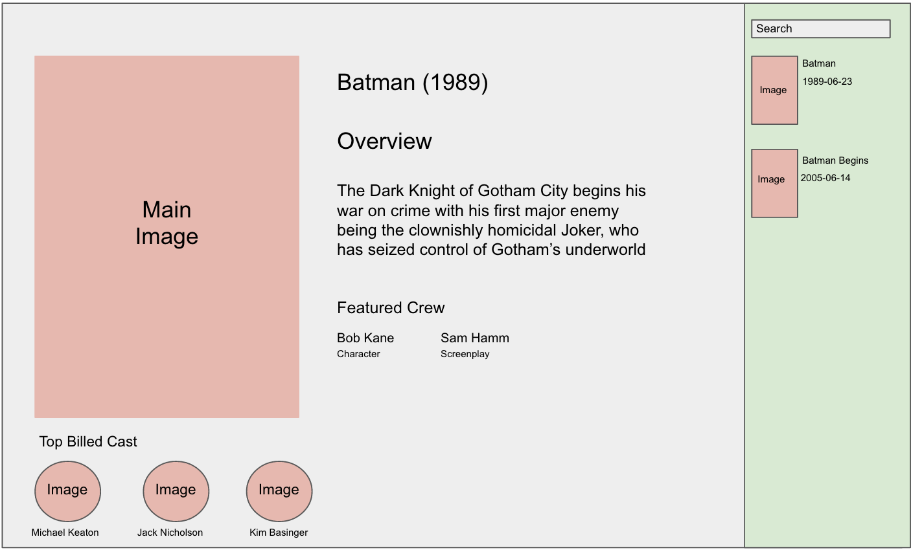

# React Take-Home Test
Take-home test for a React interview

## Task

1. Implement a front-end for a search service that searches through an collection of movie resources. _(retrieved from the movie endpoint)_ and returns a list of matching results.
2. The right pane is where the user would be searching in a Textfield
3. Searching for ‘Batman’ should return any movie with the words Batman on the right pane.
3. Once a movie title is selected on the right it should display the detail page on the left pane.

**See the included mockup** for a sample of what the final result should look like.

Assume the API might be slow.

## API

The root URL of the API is available here: https://clutter-front-end-interview.herokuapp.com. So, to get information about a movie with ID=497, you can go to https://clutter-front-end-interview.herokuapp.com/movies/497.json

There is a movie resource, and castmember resource which belongs to movie, and movie has many cast members.

#### Task Notes

* In the data provided there are two tables `Movie` and `CastMember`, you can access the index for these resources from their respective enpoints `/movies.json` and `/movies/<id>/cast_members.json`. Note that the cast_members.json endpoint doesn't have data for all movies. Some movies with data are 'Spider-Man 3', 'One Flew Over the Cuckoo's Nest', and 'Jason Bourne'. Please also note that some images for cast members may be missing, that is okay.

* The /movies.json endpoint can accept search terms in the following way:
`/movies.json?q[title_cont]=your-search-term`. the specs/controllers directory has a working example of a search operation.

## Mock up
_note: treat this as a wireframe - feel free to theme it in a modern, professional fashion._

